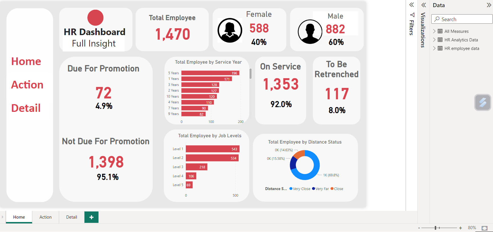

# HR Analytics Visualizaiton on Power BI

A HR Visualization from two merged datafiles to create a 3 page BI report.

From the data, using the dax, it was established that the total number of employees in the organisation is 1,470 with with 588 females and 882 males.

A logic was established to promote employees that haven't been promoted within the last 10 years

The company also wants to retrench employees that have worked with the organisation for more than 18 years

A barchart to dispaly the number of years that employees have worked with the organisation

The number of employees on each service level of the organisation

A pie chart categorizing how far employees live from the organizaiton into 'close', 'very close' and 'far' and how many in each category